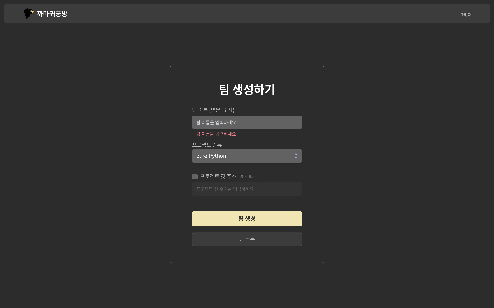
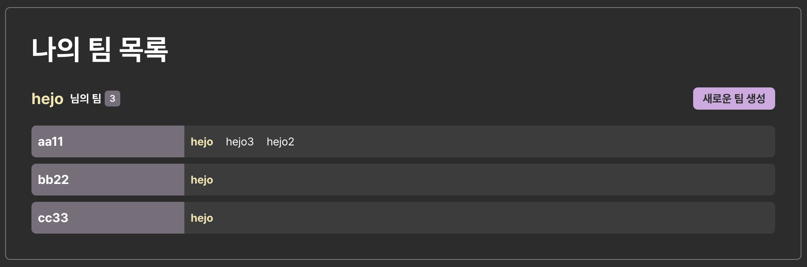
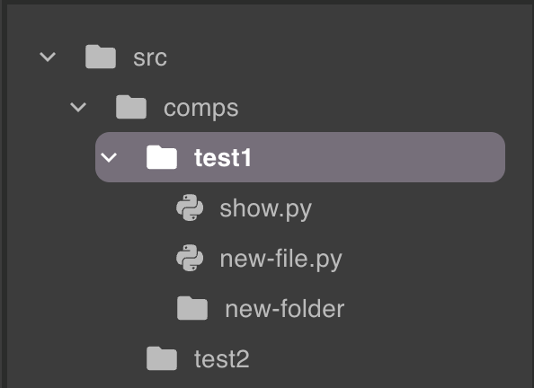

# 까마귀 공방 (Crow Studio)

> **[클릭해서 까마귀 공방 배포 링크로 이동](https://crow-studio-fe.vercel.app/)**


## 0. 목차

1. 소개
2. 사용 기술
3. 개발 기간과 구성원
4. 성과
5. 느낀 점
6. 구현 페이지 목록
7. 기타 구현 목록
8. 동작 GIF 모음

## 1. 소개

- 까마귀 공방 (Crow Studio)
- 온라인 IDE 서비스
- 사용자가 로컬에 IDE를 설치할 필요 없이, 어디서든 웹 브라우저로 까마귀 공방에 접속
- 팀원들과 함께 `Python`, `Django`, `Flask`, `FastAPI`를 이용한 코딩, 개발을 진행

### 프로젝트 관리

- VSCode 에디터를 내장하고 있어 해당 에디터에 코드 작성
- 콘솔 터미널 기능이 있어 입·출력 가능
- `Flask`, `Django`, `FastAPI` 혹은 기본 `Python` 프로젝트 중 하나를 선택해 실행하고, 서버 임시 배포 가능
- 프로젝트의 파일 디렉터리 구조 표현
- 파일·폴더 추가·삭제·변경·저장
- 작성한 코드의 Compiling, Linting, Formatting 지원
- 변수명 추천
- 환경설정 저장·불러오기
- 동시 편집
- Git 연동
- API 요청·응답 테스트

### 팀 관리

- 팀 생성·변경·삭제·탈퇴
- 팀원 검색·추가·삭제

### 회원 관리

- 닉네임 변경
- 비밀번호 변경
- GitHub 계정 연결
- 회원 탈퇴

## 2. 사용 기술

- `React`
- `React Router`: 라우팅 구현
- `Redux Toolkit`: 전역 상태 관리
- `Axios`: 서버와 네트워크 통신
- `Monaco Editor`: 코드 에디터
- `Sweetalert`, `React Modal`: 확인 모달 창
- `React Lottie`: 로딩 화면 애니메이션
- `React Split Pane`: 코드 에디터, 콘솔 터미널 스플릿 화면
- `React Tooltip`: 툴팁 표시
- `React Toastify`: 토스트 알림창
- `React Contexify`: 우클릭 컨텍스트 메뉴
- `Firebase`: 파이어베이스 연동
- CSS
  - `AOS`: 컴포넌트 애니메이션
  - `TailwindCSS`: 전체적인 CSS
  - `Styled Components`: 부분적인 CSS div
  - `MUI`: 디렉터리 트리 뷰 컴포넌트
  - `HeadlessUI`, `Heroicons`, `MUI icons`, `React Icons`: 아이콘

## 3. 개발 기간과 구성원

### 개발 기간

- 2022년 10월 ~ 2022년 11월, 약 7주

### 구성원

- 총 6명
  - FE 2명, BE 4명
- FE (2명)
  - 팀장: 함희주 (본인)
  - 팀원: 1명 (디자인도 담당)
- BE (4명)
  - 1명은 프로젝트 막바지에 FE 작업을 도움

## 4. 성과

SSAFY 7기 구미 캠퍼스 2반 자율 프로젝트 2등 수상

전국대회 본선 진출

## 5 . 느낀 점

### 프로젝트 개발을 하고 전체적으로 느낀 점

컴포넌트

- 컴포넌트를 분리할 것인지 생각하는 과정
- 어떻게 분리해서 어떤 데이터를 props로 넘겨주고, 어떤 데이터를 부모 컴포넌트에 전달을 할 것인지
- 너무 범용적이지 않게 구성하는 기준에 고민을 많이 함

함수

- 자주 사용하는 함수도 빼서 코드 중복을 최소화
- 입력값에 대한 유효성 검사 등

ES6+ 문법

JSDoc

- 다음 프로젝트에서는 JSDoc을 사용해 다른 사람도 읽고 이해하기 쉽게 작성하고 싶음
- 주석은 많이 작성하는 것이 좋다는 것을 리팩토링을 하면서 느낌

코드 가독성

- 80열을 넘어가는 코드가 최대한 없도록 작성
- 객체 리터럴로 80열이 넘어가면, 전개 구문을 활용해 최대한 여러 줄을 차지하지 않게 작성

시맨틱 태그

- 프로젝트를 끝낸 후, 시맨틱 태그를 신경 쓰지 못하고 div만 중점적으로 써서 아쉬움

CSS

- TailwindCSS를 사용했는데, 너무 클래스에 아무렇게나 추가해서 보기 불편했음
- Wrapper 컴포넌트를 만들어서 CSS 중복을 최소화 하지 못한 아쉬움

package.json

- 이것저것 깔고, 필요 없는 것은 삭제했어야 하는데 시간에 쫓겨 관리가 잘 되지 않아 아쉬움
- 다른 패키지의 도움을 많이 받았지만, 꼭 필요한 패키지가 아니라면 직접 코드를 작성해서 구현해서 사용하는 것이 의존성 측면, 용량 측면, 구현력 향상 측면에서 좋을 것 같음

## 6. 구현 페이지 목록

각 페이지를 구현하며 생긴 고민과 해결도 포함

1. 로그인 (`/login`)
2. 회원가입 (`/signup`)
3. 회원정보 수정 (`/mypage`)
4. 팀 목록 (`/teams`)
5. 팀 상세정보 (`/teams/:teamId`)
6. 팀 생성 (`/teams/create`)
7. 프로젝트 (`/project/:projectId`)

### 1. 로그인 (`/login`)

|                                                                                          |                                                       |
| :--------------------------------------------------------------------------------------: | :---------------------------------------------------: |
| 로그인 페이지 (로그인 에러 알림 창 포함)  | 로그인 폼  |

기능

- 컴포넌트 구성
  - `Login` : 로그인 페이지 자체. 서버에 전송하고 응답 처리, 전역 상태 관리
  - `LoginForm` : 폼 입력값 관리·검증 컴포넌트
- 이메일, 비밀번호를 입력받아 로그인
- 입력값 검증
  - 입력 여부, 이메일 형식(정규식), 비밀번호 길이
  - 입력값이 유효하지 않으면 입력창 아래에 붉은 에러 메시지 출력
- 로딩
  - 로그인 데이터가 제출되고 서버와 통신하는 동안 전역 로딩 상태 설정
- 로그인 성공
  - 전역 상태에 로그인 유저 정보 저장
  - 로그인 성공 토스트 출력, 팀 목록으로 리다이렉트
- 로그인 실패
  - 에러 토스트 출력

고민

1. `Login` 컴포넌트에서 폼 입력값 관리·검증, 에러 메시지 출력, 서버 통신, 전역 상태 관리를 모두 담당
   - 코드가 길어지고 복잡해져서 나중에 코드를 수정하려고 했을 때, 한 눈에 파악하기 어려움
2. 입력창에 대한 `input` 태그를 쓰는데 중복되는 부분이 많음
   - 디자인도 거의 같으며, 해당 입력창에 대한 에러 메시지를 표시하는 부분도 동일
3. 이메일, 비밀번호 입력이 완료되고 제출했을 때, 해당 함수가 길어짐
   - 입력창을 지우고, 입력값을 검증하는 부분
4. 가독성 좋은 코드 작성에 대한 고민
   - 줄여서 작성한다고 좋은 것은 아니지만, 코드를 효율적이고 보기 좋게 작성하기 위해 노력
5. 핸들러 이름을 어떻게 해야할지 고민
   - `submitHandler`? `loginHandler`? `onLogin`?

해결

1. 폼 입력값 관리·검증만 하는 컴포넌트 `LoginForm` 생성하고 분리
   - `Login` 컴포넌트에서는 검증된 입력값을 `LoginForm`으로부터 받고, 서버와 통신, 전역 상태 관리
   - 각 컴포넌트의 역할을 나눠 관리하기 좋아졌고, 코드 가독성이 증가해 다음에 코드를 봐도 이해가 쉬움
2. `Input` 컴포넌트를 생성해서 라벨, 입력창, 에러 메시지, 디자인을 하나로 묶음
   - `Form` 종류의 컴포넌트를 다수의 `Input` 컴포넌트로 구성
   - `Input` 컴포넌트는 입력값만 감지·전달하고 `LoginForm`에서 입력값 관리·검증
   - 회원가입, 회원정보 수정, 팀 생성 등의 입력창이 필요한 곳에서도 `Input` 컴포넌트 사용 가능
   - 범용적으로 사용 가능할 수록, 더 많은 `props`를 넘겨줘 또 다른 고민이 생김
3. 입력값을 검증하는 `checkIsValid` 함수를 따로 빼서 작성
   - 아예 다른 파일에 작성하고 export를 사용하는 방법을 구상했어야 하는 아쉬움
   - 입력창을 사용하는 다른 페이지에서도 입력값 검증이 필요하기 때문
4. ES6+ 문법 숙지하고 능률적으로 사용
   - 구조 분해 할당

```javascript
// Before
const dispatch = useDispatch();
const navigate = useNavigate();
// After
const [dispatch, navigate] = [useDispatch(), useNavigate()]; // 구조 분해 할당
```

### 2. 회원가입 (`/signup`)

|                                                                                                         |                                                              |
| :-----------------------------------------------------------------------------------------------------: | :----------------------------------------------------------: |
| 회원가입 페이지 (이미 사용중인 이메일 알림창 포함)  | 회원가입 폼  |

기능

- 컴포넌트 구성
  - `Signup` : 회원가입 페이지 자체. 서버에 전송하고 응답 처리, 전역 상태 관리
  - `SignupForm` : 폼 입력값 관리·검증 컴포넌트
- 이메일(중복 불가), 닉네임, 비밀번호를 받아 회원가입
- 입력값 검증
  - 입력 여부, 이메일 중복, 이메일 형식(정규식), 닉네임 길이, 비밀번호 길이, 비밀번호 일치
  - 입력값이 유효하지 않으면 입력창 아래에 붉은 에러 메시지 출력
- 로딩
  - 회원가입 데이터가 제출되고 서버와 통신하는 동안 전역 로딩 상태 설정
- 회원가입 성공
  - 전역 상태에 회원가입 유저 정보 저장
  - 회원가입 성공 토스트 출력, 팀 목록으로 리다이렉트
- 회원가입 실패
  - 에러 토스트 출력

고민

1. 다루는 입력값이 4가지라서, 객체의 state를 사용해서 관리
   - `setInput(prev => return { ...prev, newData });` 식으로 관리
   - `return` 부분이 길어져서 고민. 줄 넘김도 길어져서 가독성이 떨어짐
2. 리팩토링을 진행하며 `Firebase`를 사용했는데, 유저 인증 정보에 원하는 데이터를 넣을 수 없었음
3. 로그인, 회원가입은 로직이 비슷해서 입력값 검증 등의 중복되는 부분을 제거할 수 있을 것 같음
4. 코드가 너무 길어져서 해결할 방법이 없을까 고민

```javascript
const userToAdd = {
  uid: user.uid,
  email,
  nickname,
  password: '',
  imageURL: '',
  gitUsername: '',
  gitToken: '',
  teams: [],
};
```

해결

1. `setInput(prev => ({ ...prev, newData });`로 해결
   - 객체를 리턴한다면, 소괄호로 감싸면 된다는 것을 배움
   - 줄도 넘기지 않아 코드가 간결해지고 보기 좋아짐
2. 인증 데이터 따로, `Firestore`에도 `users` 컬렉션을 생성하고, 새 유저 도큐먼트를 삽입해 해결
3.
4. ES6+의 전개 구문을 활용해 가독성을 향상
   - 80열을 넘어가지 않게 하도록 노력

```javascript
const basic = { uid: user.uid, email, nickname, password: '' }; // 기본 유저 정보
const extra = { imageURL: '', gitUsername: '', gitToken: '', teams: [] }; // 추가 유저 정보
const userToAdd = { ...basic, ...extra }; // firestore의 users 컬렉션에 추가할 회원가입된 유
```

### 3. 회원정보 수정 (`/mypage`)

|                                                                                                                        |                                                              |
| :--------------------------------------------------------------------------------------------------------------------: | :----------------------------------------------------------: |
| 회원정보 수정 페이지 (닉네임 클릭 시 컨텍스트 메뉴 포함)  |                                                              |
|        깃 아이디, 토큰 변경, 탈퇴 부분         | 탈퇴 모달  |

기능

- 컴포넌트 구성
  - `Mypage` : 회원정보 수정 페이지 자체. 서버에 전송, 응답 처리, 전역 상태 관리
  - `MypageProfile` : 유저 정보 출력 컴포넌트
  - `MypageModifyForm` : 폼 입력값 관리, 검증 컴포넌트
- 닉네임 변경, 비밀번호 변경, 깃 아이디 변경, 탈퇴
- 입력값 검증
  - 입력 여부, 닉네임 길이, 비밀번호 길이, 깃 아이디, 깃 토큰
  - 입력값이 유효하지 않으면 입력창 아래에 붉은 에러 메시지 출력
- 로딩
  - 회원정보 수정 데이터가 제출되고 서버와 통신하는 동안 전역 로딩 상태 설정
- 회원정보 수정 성공
  - 전역 상태에 수정된 유저 정보 저장
  - 탈퇴 성공시 로그아웃까지 진행
  - 회원정보 수정 성공 토스트 출력
- 회원정보 수정 실패
  - 에러 토스트 출력

고민

1. 닉네임 변경 폼, 비밀번호 변경 폼, 깃 변경 폼, 탈퇴 버튼으로 4가지 기능
   - 하나의 컴포넌트에서 관리하는 것이 맞는지, 각 폼에 대한 컴포넌트로 나누는 것이 맞는지
   - 코드가 짧아도 컴포넌트로 나눠서 관리해야 하나?
   - 그렇게 컴포넌트를 너무 여기저기 나누면 관리하기 힘들지 않을까?
2. `Mypage` 컴포넌트에서 모든 핸들러 로직을 담당하니 코드가 길어짐
   - 효율적으로 어떻게 구성할 수 있을까?
   - 핸들러들만 따로 관리하는 컴포넌트를 하나 만들어서 관리해야할까?

해결

1. 각 폼의 코드의 양이 그렇게 많지 않았기 때문에 한 컴포넌트에서 관리

### 4. 팀 목록 (`/teams`)

|                                                                 |                                                                               |
| :-------------------------------------------------------------: | :---------------------------------------------------------------------------: |
| 팀 목록 페이지  | TeamListItem 컴포넌트  |

기능

- 컴포넌트 구성
  - `Teams` : 팀 목록 페이지 자체. 서버에서 팀 목록 정보 받고 배열로 관리
  - `TeamsListItem` : 하나의 팀 정보 출력하고 클릭시 해당 팀 상세정보로 이동하는 컴포넌트
- 소속된 팀 목록 출력
  - 팀 개수, 팀 이름, 팀장 이름, 팀원 이름
- 새로운 팀 생성 버튼

고민

1. `List` 컴포넌트는 코드의 양이 적었기 때문에 괜히 컴포넌트로 분리하는 것은 별로인가?
2. 리팩토링 이후 `Firestore`에서 팀 정보를 가져 오는 것에 대한 시행착오
3. DB의 데이터 구조가 있는데, 페이지에서 필요한 데이터 구조를 따로 만드는 것은 괜찮은가?
4. 팀 목록 페이지에서 다른 페이지에 갔다가, 뒤로가기로 다시 돌아오면 서버에 다시 요청을 해서 팀 목록 데이터를 가져옴
   - 로컬 스토리지나 `indexedDB` 같은 곳에 저장을 해둬서 서버의 부하를 줄이는 것이 나은가?
5. 데이터가 화면에 출력될 때, 팀이 많다면 주르륵 하고 생성됨
   - 로딩중이라는 컴포넌트를 넣어두고, 몇 개씩 출력하는 것이 사용자 경험 측면에서 좋을 것 같음

해결

1. 각 팀의 정보를 나타내는 `ListItem`만 컴포넌트로 만들고, `List` 컴포넌트는 삭제
   - 파일 개수를 증가시키지 않고, depth도 증가시키지 않음
   - 너무 컴포넌트로 분리하는 것도 별로인 것인지 더 경험이 필요할 것 같음
2. `Firestore`에서 팀 정보를 가져오는 순서
   1. 로그인된 현재 유저의 `docId` 값으로 소속한 팀들의 `docId` 값의 배열을 가져 옴
   2. 각 팀의 `docId`로 해당 팀의 데이터 가져오기
   3. 팀 리더의 `docId`로 해당 유저의 정보 가져오기
   4. 각 팀원의 `docId`로 해당 유저의 정보 가져와서 배열에 추가
   5. 팀 목록 가져오는 데에 서버와 통신하는 횟수가 많은 것 같아서 고민
3. `users` 컬렉션의 데이터와, `teams` 컬렉션의 데이터를 `myTeams`라는 state 배열에 필요한 것만 저장
   - 괜히 나중에 헷갈리지 않게 주석을 작성
4.
5.

### 5. 팀 상세정보 (`/teams/:teamId`)

|                                                                                |                                                                                            |
| :----------------------------------------------------------------------------: | :----------------------------------------------------------------------------------------: |
|  팀 상세정보 페이지   |                                                                                            |
| 팀 이름 수정 입력창  |         팀 이름 수정 성공          |
| 팀원 검색·추가 모달  |       팀원 추가 확인 모달        |
| 팀원 삭제 확인 모달  | 프로젝트 타입 수정 선택창  |

기능

- 컴포넌트 구성
  - `TeamDetail` : 팀 상세정보 페이지 자체. 서버에서 팀의 상세정보를 받고, 서버로 전송
  - `TeamDetailHeader` : 팀명, 팀명 수정, 팀 삭제, 탈퇴 버튼 출력 컴포넌트
  - `TeamDetailMain` : 팀원, 팀원 검색·추가·삭제, 깃 주소, 프로젝트 타입, 프로젝트 타입 수정 컴포넌트
- 해당 팀의 상세 정보
  - 팀 이름, 팀장, 팀원, 깃 주소, 프로젝트 타입
- 팀 정보 수정
  - 팀 이름 수정
  - 팀원 검색·추가·삭제
  - 프로젝트 타입 수정
- 팀 삭제·탈퇴
- 팀 목록 이동 버튼, 프로젝트 이동 버튼

고민

1. `TeamDetail` 에서 데이터 수정에 대한 모든 핸들러를 정의하고 있어서 코드 길이가 길어짐
2. 팀원 추가의 경우, 모달 창에서 또 검색을 진행하고, 검색 결과를 출력해야 해서 코드가 길어지고 복잡
3. 핸들러가 많아지고 변수도 많아져 이름 짓기가 어려워짐
   - `findTeammate`, `foundTeammates`, `myTeammates`, …
4. 해당 페이지에서만 사용하는 컴포넌트는 해당 페이지 폴더에 넣어야 하는지, 컴포넌트만 모은 폴더에 위치시켜야 하는지 고민

해결

1. 핸들러들을 담당하는 컴포넌트 생성해서 분리해야 하나?
2. 해당 모달은 따로 컴포넌트로 만들고 분리
   - 검색 결과·출력 모달은 해당 기능만 담당하게 나눠 헷갈리지 않게 됨
3.
4.

### 6. 팀 생성 (`/teams/create`)

|                                                                          |                                                                                      |
| :----------------------------------------------------------------------: | :----------------------------------------------------------------------------------: |
|     팀 생성 페이지      |                                                                                      |
| 프로젝트 종류 선택  | 깃 주소 체크시 입력 가능  |
|          로딩 화면           |   팀 목록으로 리다이렉트    |

기능

- 컴포넌트 구성
  - `TeamCreate` : 팀 생성 페이지 자체. 서버에 전송하고 응답 처리, 전역 상태 관리
  - `TeamCreateForm` : 폼 입력값 관리·검증 컴포넌트
- 팀 이름(영문·숫자), 프로젝트 종류(4가지), 프로젝트 깃 주소(선택) 받아 팀 생성
- 입력값 검증
  - 입력 여부, 팀 이름(영문·숫자), 팀 이름 길이
  - 입력값이 유효하지 않으면 입력창 아래에 붉은 에러 메시지 출력
- 로딩
  - 생성할 팀 데이터가 제출되고 서버와 통신하는 동안 전역 로딩 상태 설정
- 팀 생성 성공
  - 팀 생성 성공 토스트 출력, 팀 목록으로 리다이렉트

고민

1. 리팩토링 이후 팀을 생성하면서, 프로젝트 데이터도 생성해야 함

해결

1. `Firestore`에 프로젝트 생성하는 과정
   1. `teams` 컬렉션에 생성된 팀 추가
   2. `users` 컬렉션에 현재 로그인한 유저의 `teams` 필드에 생성된 팀 `docId` 추가
   3. `projects` 컬렉션에 생성된 프로젝트 추가
   4. `teams` 컬렉션에서 현재 생성된 팀의 프로젝트 `docId` 필드를 생성된 프로젝트로 갱신

### 7. 프로젝트 (`/project/:projectId`)

|                                                                                                                                                 |                                                                                                               |
| :---------------------------------------------------------------------------------------------------------------------------------------------: | :-----------------------------------------------------------------------------------------------------------: |
|                                      프로젝트 페이지                                       |                                                                                                               |
|                                        디렉터리 구조                                         | 파일 경로, 에디터, 콘솔 터미널 예시  |
|                                      깃 커밋, 브랜치                                       |                          API 테스트                           |
|                                            환경 설정                                             |                        현재 팀 정보                         |
|                                          변수명 추천                                           |                        새 파일 생성                         |
|                                        새 폴더 생성                                          |            새 파일, 폴더 생성 결과              |
| 새 파일, 폴더 생성 토스트   |     파일·폴더 우클릭 컨텍스트 메뉴       |
|                                           이름 변경                                             |                     파일·폴더 삭제                       |

기능

- 컴포넌트 구성
  - `Project` : 프로젝트 페이지 자체. 서버에 전송하고 응답 처리, 전역 상태 관리 컴포넌트
  - `ProjectContent` : 선택된 파일 경로 표시, 코드 에디터, 콘솔 입력·출력 터미널 컴포넌트
    - 코드 에디터 내용 저장, 저장하면 포맷팅(프리티어) 적용된 텍스트로 변환
    - 코드 에디터에 작성한 내용이 맞는 문법인지 체크하고 수정할 내용과 해당 줄의 번호 출력
    - Input 터미널에 값 입력, 코드 에디터 내용 컴파일 후 Output 터미널에 결과 출력
  - `Directory` : 디렉토리 파일 구조 표현, 파일·폴더 생성·삭제·이름변경·내용저장
  - `Git` : 깃 계정에 연결된 경우, 현재 브랜치에서 작업한 내용 커밋·푸시
    - 새로운 브랜치 생성
    - 로컬 브랜치, 레포 브랜치 조회
  - `Team` : 팀장, 팀원 목록 확인
  - `Api` : 빌드된 프로젝트에 대해 API 요청 전송
    - URI 입력하고 메서드 선택, 요청 헤더·바디 작성
    - 응답 바디와 함께 소요된 시간까지 출력
  - `VariableName` : 입력된 한글 단어에 대해 변수명 추천
  - `Settings` : 에디터 폰트 종류·크기, 콘솔 폰트 종류·크기, 에디터 자동 줄바꿈 설정하고 저장
- 프로젝트 핵심이고 가장 시간 많이 걸리고 어려웠던 부분
- `Project`, `ProjectContent`, `Directory`, `Team` 부분을 맡아 개발
  - 코드 에디터, 콘솔 터미널, 디렉토리, 팀

고민 - 전체

1. 다루는 컴포넌트와 기능이 많아서 가장 어려웠고 시간이 오래 걸렸던 페이지
2. 팀원과 같이 개발하면서 같은 파일을 계속 수정해야 했기 때문에 코드가 많이 복잡해짐
3. 좌측 사이드바, 우측 코드 에디터, 콘솔 터미널 부분으로 크게 나눴는데 해당 값들을 서로 필요로 해서 props를 넘기고 전달하고 그런 부분이 제일 까다롭고, 에러가 많이 발생
4. 입력값에 대한 유효성 검사를 여기저기 (로그인, 회원가입 등 입력창 쓰는 곳) 에서 하니까 관리가 힘듦

해결 - 전체

1. .
2. 매일 서로 어떤 식으로 코드를 짰는지 소통하고, 최대한 주석을 남겨 설명이 되도록 함
3. 두 부분에서 공통적으로 사용하는 데이터는 제일 상위 컴포넌트에서 값을 state로 관리하고 props로 전달
   1. 팀 정보, 개인 환경 세팅 정보, 현재 선택된 파일이나 폴더의 정보, 현재 선택된 사이드바
4. 여기저기서 비슷한 코드를 작성하는 것은 유지보수에 매우 좋지 않다는 것을 깊이 느낌

고민 - Editor

1. `textarea` 태그로 에디터를 만들기에는 너무 구현해야 할 기능이 많음
2. 유저가 에디터에 작성한 코드를 어떻게 텍스트로 내용을 가져올 수 있을지
   1. 저장을 하면 유저가 작성한 코드를 다듬고 다시 에디터에 출력해야 함
3. 선택한 파일의 내용을 에디터에 출력해야 함

해결 - Editor

1. VSCode에도 사용된다는 Monaco Editor를 사용해서 구현
2. `useRef`를 사용해서 에디터에 대한 `ref`를 전달하고, 거기서 값을 가져오고 설정할 수 있었음
3. 선택한 파일 내용·경로·이름을 전역 상태로 관리해 props 전달을 최소화

고민 - Console Terminal

1. 그냥 `textarea`를 사용해서 구현해도 좋은지 고민
2. 코드가 길어져서 컴포넌트로 분리했는데, 상태 관리가 복잡
3. 입력, 출력 부분이 따로 있었기 때문에 서로 공통된 부분의 중복을 제거할 수 있었을 것 같아 아쉬움

해결 - Console Terminal

1. 단순 값 입력이기 때문에 해당 태그로 구현
2. 해당 컴포넌트에서만 사용하는 것은 그쪽 부분에서 정의하고 사용할 수 있도록 최대한 노력
3.

고민 - Directory

1. 가장 핵심이면서 가장 어려웠던 부분
2. 어떻게 파일 디렉토리 구조를 표현할 것인지?
3. 현재 선택한 파일이나 폴더를 어떻게 알 수 있는지?
4. 현재 선택한 파일의 내용을 어떻게 가져오고 에디터에 출력할 것인지?
5. 파일 내용 저장하기
6. TreeView에 팀의 디자인을 적용하고 아이콘을 추가하기 위해서 수정할 것이 많아 코드 양이 증가

해결 - Directory

1. 백엔드 담당 팀원과 계속 소통하면서 조율. 서로 원하는 것을 잘 표현하고 이해시키려 노력
   1. 소통과 전달이 중요하다는 것을 느낌
2. MUI의 TreeView 컴포넌트를 사용해서 구현
   1. 이 컴포넌트에 맞는 데이터를 객체 형식으로 전달해야 했기 때문에, 백엔드 팀원과 소통하며 조율함
3. `onNodeSelect`에 핸들러를 추가할 수 있어 선택한 노드의 `nodeId`를 가져옴
   1. `nodeId`를 파일 경로로 표현했기 때문에, 여기에서 파일 이름·경로·확장자를 전부 알 수 있음
   2. 예시: `src/temp/main.py` 같이 `nodeId`를 구현
   3. 얻은 이름·경로·확장자를 전역 상태로 관리
4. 파일·폴더를 클릭할 때마다 리렌더링을 진행하고, 파일인 경우 서버에서 해당 내용을 받아와 에디터에 출력
5. 순서
   1. 현재 에디터의 내용을 담아 파일 포맷 요청을 전송
   2. 파일 포맷 결과를 받고, 전역 상태에 해당 파일 내용 저장
   3. 파일 내용을 다시 서버에 전송해 린트 적용하고 린트 결과 받기
   4. 서버에서 현재 파일 경로의 파일 내용 가져오고 에디터에 설정
   5. 차근차근 진행하니 해결할 수 있었음
6. 스타일 적용, 아이콘 적용하는 부분을 따로 나누고 함수화

## 7. 기타 구현 목록

1. 내비게이션 바
2. 라우터
   - Protected·Private 라우트
   - 로그인 상태에 따라 접근 가능한 페이지를 나누고, 리다이렉트 하게 구현
   - 새로고침 하면 순간적으로 로그인이 안 된 상태에서 로그인 된 상태로 넘어가는 현상을 해결 못해서 아쉬움
3. 로그인 유무
   - 로컬 스토리지에 Access Token을 저장하는 방식
   - 다음 프로젝트에는 Refresh Token을 도입하고 싶고, Access Token도 취약한 로컬 스토리지가 아닌 쿠키에 저장해보고 싶음
   - 리팩토링 이후 Firebase를 사용해 인증
4. Redux-Toolkit
   - 전역 상태 관리
     - 현재 로그인한 유저 정보와 상태
     - 로딩 상태
     - 작업중인, 선택한 파일·폴더 정보
5. Firebase
   - 리팩토링을 진행하며 인증, 데이터 부분을 Firestore로 교체
   - 향후 프로젝트에서 어떻게 Firebase와 React를 같이 사용할 수 있을지에 대해 알게 됨

## 8. 동작 GIF 모음

[동작 GIF 모음](https://sable-exhaust-9f0.notion.site/GIF-d52fa869d94e4d21825f7390935594b6)

[프로젝트 상세·소감](https://sable-exhaust-9f0.notion.site/Crow-Studio-1caad688a104461482a87a5241230e2c?pvs=74)

- README로 이동 완료
